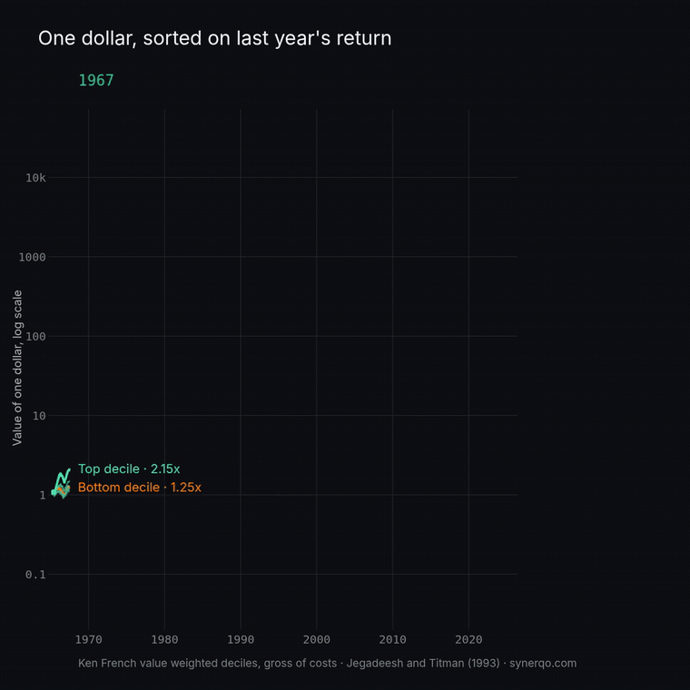

# Quant Paper Lab

Landmark papers from the financial engineering literature, reproduced on public data, with
the figures made interactive. One paper at a time. Built by [Synerqo](https://synerqo.com).

Each paper ships as three things: a page in the Streamlit app, a square MP4 for the feed, and
the post copy. The code that produces every number is here, so a reader can check the result
instead of taking it on faith.



## Run it

```bash
uv sync --group dev --group render
uv run streamlit run streamlit_app.py          # http://localhost:8501
uv run --group dev pytest -q
```

Data is committed as derived parquet, so the app runs immediately after a clone. To rebuild
it from the source:

```bash
uv run --group dev python -m papers.jegadeesh_titman_1993.build_data
```

To screenshot the running app, which is the only way to judge layout:

```bash
uv run --group dev --group render python tools/shoot.py --out /tmp/shots --animate momentum-1993
```

To re-render the video and the GIF:

```bash
uv run --group render python -m papers.jegadeesh_titman_1993.animate
uv run --group render python -m papers.jegadeesh_titman_1993.animate --preview 1989
```

Scripts under `papers/` run with `-m` because they import the shared `lab` package.

## Layout

```
streamlit_app.py     navigation, built from papers/
home.py              the library index
lab/                 shared: theme, data access, page furniture, video render, manifest
papers/<slug>/       one self-contained paper: paper.yaml, build_data, figures, page,
                     animate, post
data/                derived parquet, committed. data/raw/ is not
out/                 rendered MP4 and GIF, not committed
published/           manifest.json, read by the linkedin-connector repo
```

Adding a paper means adding a folder. Navigation, the home index and the manifest all read
from `papers/*/paper.yaml`, so nothing gets registered twice. Use `/new-paper <slug>`.

## Rules this repo keeps

**Public data only.** Kenneth R. French Data Library, FRED, Stooq, public CBOE files. Never
CRSP, WRDS or OptionMetrics. Only derived series are committed, with the source named and the
rebuild script next to them. No paper PDF, figure or table is ever republished here.

**No network at request time.** Everything the app displays was computed offline. A post can
send hundreds of readers at once into a 1 GB container, and a cold start that recomputes
would fall over exactly when it matters. A test enforces this by taking sockets away.

**One source of visual truth.** `papers/<slug>/figures.py` serves both the app and the video.
The video is never a screen recording, it is the same figures rendered offline, so it can be
rebuilt at any time. Figures are rendered with `theme=None`, otherwise Streamlit replaces
their typography with its own and only the video keeps the house style.

**Every control degrades, never raises.** An exception in a Streamlit page does not blank a
chart, it blanks the page, and the standing disclaimer goes with it. The suite drives every
control to its extremes and asserts the notice is still there.

**Arrow runs on a pool that does not crash.** pyarrow 25 defaults to mimalloc, and Streamlit
serialising a dataframe on it kills the whole server with SIGSEGV, no Python traceback,
usually on the first page load. `lab/arrow.py` sets `ARROW_DEFAULT_MEMORY_POOL` before pyarrow
loads, which is the only lever that works: `pyarrow.set_memory_pool()` moves the Python
default and the crash survives it. Re-measure with `tools/soak.py --pool mimalloc`. pandas is
also held below 3, from an earlier segfault with a different native trace, inside
`pivot_table`; that pin stays until pandas 3 is tested on purpose.

**One precision for every number on screen.** Two decimals, from `lab/format.py`: hovers,
annotations, tiles, tables and axis ticks. Published prose keeps its own writing.

**LinkedIn does not animate GIFs.** An uploaded animated GIF is flattened to its first frame.
The feed asset is a native MP4, square, muted, with labels burned in. The GIF above is a
by-product for this README and for other networks.

**The caveat ships with the result.** Every page carries the sources and a standing notice:
these are historical academic portfolios on public data, gross of costs, not the performance
of any Synerqo strategy, and not investment advice.

## The library

| Paper | What you can turn |
| --- | --- |
| Jegadeesh and Titman (1993), *Returns to Buying Winners and Selling Losers* | The formation horizon, which flips the sign of the effect. The weighting, where equal weighted reproduces the published 1.31 percent a month and value weighted reads 1.63. A fan you can play, watching one dollar split into ten deciles and the mark land as the window passes publication. And a ten year window you can play or drag through 2009 to watch the size and momentum tilt disappear |

## Licence

Code under MIT. The data belongs to its sources, which are named on every page.
